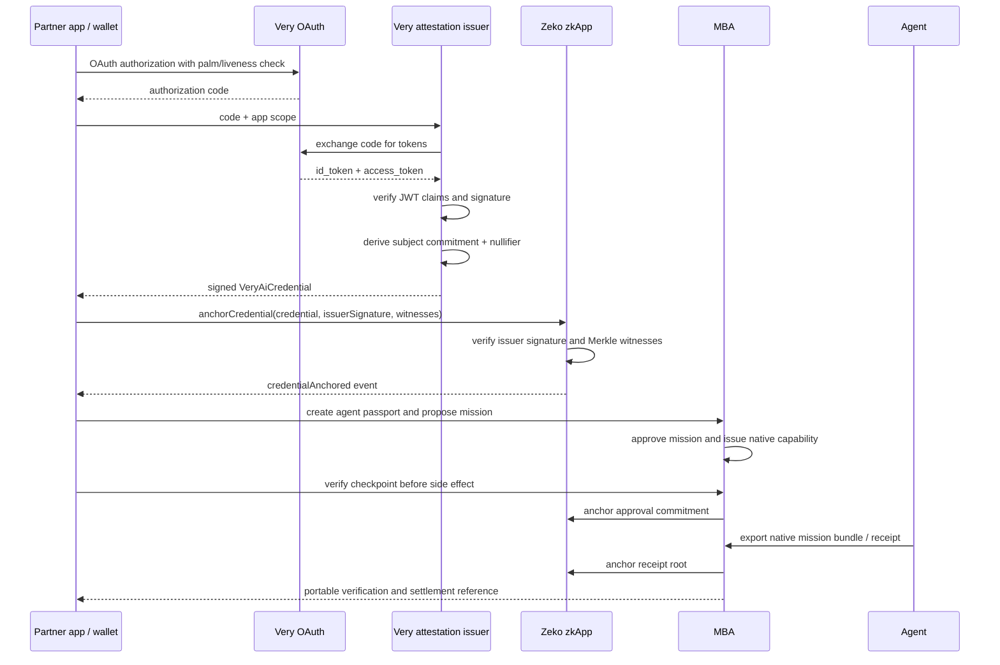

# Very AI on Zeko

This is a starter integration for bringing Very AI's human/liveness identity layer to Zeko without putting biometric data, OAuth tokens, or stable user identifiers on-chain. It implements the partnership in two steps: anchor a Very credential, then hand the approved action to Zeko's native Agent Mission-Bound Auth protocol for mission-scoped authorization and anchoring.

Because this integration is built directly for Zeko's rollup and zkApp model, VeryAI can carry its proof-of-human signal into programmable on-chain state rather than stopping at a generalized protocol handoff. The Very result is reduced to privacy-preserving commitments and a nullifier, verified in a Zeko zkApp, and made available for eligibility checks, scope enforcement, replay protection, and settlement without exposing biometric data or the underlying identity. From there, native Mission-Bound Auth can bind the verified-human signal to a precise agent mission, checkpoint, payment, or receipt, giving VeryAI a rollup-native path from human verification to composable authorization for apps, agents, wallets, and marketplaces.

Very handles the palm/liveness OAuth flow off-chain. A Very-operated issuer service verifies the OAuth `id_token`, derives privacy-preserving commitments, signs the resulting credential with a Zeko-compatible o1js issuer key, and submits it to this Zeko zkApp. The zkApp verifies the issuer signature, anchors the credential commitment, and burns a nullifier so the same proof-of-human event cannot be replayed for the same scope.

## Architecture



## What This Integration Proves

- The credential was signed by the configured Very issuer key.
- The same subject/scope credential was not already anchored.
- The same nullifier was not already spent.
- The public chain sees commitments only: `subjectCommitment`, `scopeHash`, `authContextHash`, and `nullifier`.
- The credential binds a holder Zeko key without putting the Very subject identifier on-chain.
- Step 2 uses the native mission-bound-auth protocol's passport, mission, approval, checkpoint, bundle, and Zeko anchoring surfaces.

## Step 2: Native Mission-Bound Authorization

Step 2 is deliberately an integration with the native Agent Mission-Bound Auth protocol, not a second mission protocol in this repository. VeryAI should call the mission authority through `MissionBoundAuthClient`:

1. Create or resolve the agent passport.
2. Propose a mission containing the exact task, operation, tools, scopes, payment rails, budget, and expiry.
3. Approve the mission through the native authority.
4. Verify the native checkpoint before a payment, compute job, or external side effect.
5. Export the native mission bundle and attach the Very credential commitment as the auth context.
6. Use the native Zeko approval and receipt anchoring flow.

The native service owns mission schemas, capability construction, signatures, nullifiers, checkpoint enforcement, replay state, receipts, and settlement conditions. This repository only provides an HTTP adapter and Very-to-native integration boundary; it does not copy or reimplement those mechanisms.

## Files

- `src/VeryAiCredentialRegistry.ts` - o1js smart contract for Zeko.
- `src/mission-bound-auth.ts` - HTTP adapter for the separately licensed native mission-authority service.
- `src/very-oauth.ts` - backend adapter for Very OAuth code exchange and credential construction.
- `scripts/demo-local.ts` - local o1js demo covering credential anchoring.
- `scripts/demo-mission-bound-auth.ts` - live integration demo against the separately operated native mission authority.
- `scripts/deploy-zeko.ts` - Zeko Sepolia deployment scaffold.
- `scripts/smoke-zeko.ts` - live Zeko Sepolia smoke for Step 1 with a test credential.
- `test/very-ai-credential-registry.test.ts` - local contract test.
- `test/mission-bound-auth.test.ts` - adapter test proving calls stay at the native protocol boundary.
- `THIRD_PARTY_NOTICES.md` - licensing and attribution boundary for Step 2.

## Local Run

```bash
npm install
npm run doctor
npm test
npm run demo
```

To run the native Step 2 integration against an authorized mission-authority service:

```bash
MISSION_AUTH_BASE_URL=http://127.0.0.1:8787 npm run demo:mission
```

The service must be operated separately under its own license and production-use conditions. Set `MISSION_AUTH_BEARER_TOKEN` for a production profile.

For real proofs:

```bash
PROOFS_ENABLED=true npm run demo
```

## Zeko Ethereum Sepolia Deploy

This demo targets Zeko on Ethereum Sepolia. Create `.env` from `.env.example`, fund the deployer with sETH, and run:

```bash
npm run deploy:zeko
```

Default network configuration:

- GraphQL: `https://sepolia.zeko.io/graphql`
- o1js/Auro signing domain: `testnet` (intentional for Zeko Sepolia)
- Transaction fee: `200000` base units (`0.0002 sETH`)
- Archive endpoint: optional; leave `ZEKO_ARCHIVE_URL` empty unless a compatible archive service is available.

Current demo deployment:

- zkApp: `B62qoYAimKDP91netrAB6RsPEDjiY8sJ766LjLUdD9uVmi6EFzYrRZi`
- issuer: `B62qkorFr2koERcVVReaT83nFqC7EUukbN9y3yQPoWgwoyjxE5UVwgH`

These are demo identities only. Replace the issuer and zkApp keys before production use.

Do not reuse an earlier-network contract address or state file. The deployment script creates a fresh Step 1-only contract, waits for its account to appear on Sepolia, configures the Very issuer key, and prints the verified deployment identity. The smoke script is intended for that fresh deployment because its witness store starts from empty roots:

```bash
export ZEKO_ZKAPP_ADDRESS=<fresh-deployment-address>
npm run smoke:zeko
```

## Very Issuer Flow

The issuer service should:

1. Receive the mobile OAuth `code` and intended app `scope`.
2. Exchange the code at `https://api.very.org/oauth2/token`.
3. Verify the `id_token` signature against Very's JWKS and validate `iss`, `aud`, `exp`, and nonce/state.
4. Build a `VeryAiCredential` with a KMS-held salt.
5. Sign `issuerAuthorizationMessage(zkappAddress, sequence, credential)` with the configured Zeko issuer key.
6. Return the credential, signature, and current Merkle witnesses to the client or relayer.

The included adapter has the token exchange and claim validation scaffolding. Production should add JWKS signature verification before signing any Zeko credential.

After Step 1 is anchored, call the native mission-authority service through `MissionBoundAuthClient`. Do not recreate its mission objects, capability hashes, JWS signatures, checkpoint enforcement, nullifier state, or Zeko anchoring contracts in the VeryAI integration.

## Integration Status

This starter is fully wired at the Zeko/o1js Step 1 layer and exposes a Step 2 adapter for the native mission-bound-auth service. It does not ship with a registered Very OAuth application, mobile SDK callback app, or production token signature verifier because those require Very-issued credentials and confirmation of the token signing method.

Before calling it a full Very production integration, add:

- a Very-registered `client_id`, `client_secret`, and `redirectUri`;
- an iOS, Android, or Flutter app using VeryOauthSDK to obtain the OAuth `code`;
- production ID-token signature verification, using Very's published JWKS if tokens are asymmetric, or the agreed backend secret flow if tokens are HMAC-signed;
- a KMS-held Very issuer key for Zeko attestations;
- a funded Zeko Sepolia deployer;
- an authorized deployment of the native Agent Mission-Bound Auth service, with its production license and fee/anchoring conditions preserved.

The Zeko credential boundary is complete for the prototype. Step 2 is now represented by a native-protocol adapter and must be exercised against the separately licensed mission authority before calling the full partnership integration complete.

For the demo-to-production handoff, see [PRODUCTION.md](PRODUCTION.md). It separates the public integration scaffold from the Very-controlled issuer, credentials, and deployment infrastructure.

## Product CTA

The most compelling demo is a "prove I am a live human, then settle a zkApp action" flow:

1. User completes Very palm/liveness OAuth on mobile.
2. The issuer signs a `zeko:human-liveness:v1` credential bound to the user's Zeko holder key.
3. The Zeko zkApp anchors the credential commitment and burns the credential nullifier.
4. VeryAI proposes and approves the exact action through native Agent Mission-Bound Auth.
5. The native authority verifies checkpoints, exports a portable bundle, and anchors the approval/receipt roots on Zeko.

That gives Very a compelling message: Very verifies the live human; Zeko verifies the bounded authorization and settlement. The initial launch can market Step 1 immediately, while Step 2 becomes the differentiating Zeko-native upgrade.
